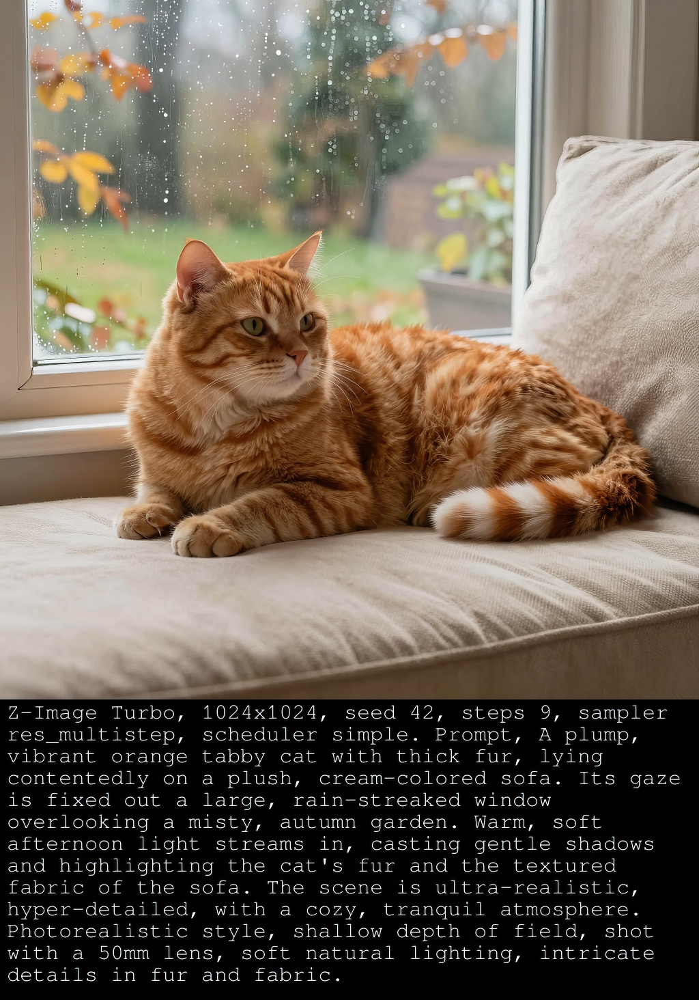

# ComfyUI DeepSeek Prompt Connector

Custom ComfyUI node for generating or improving prompts via DeepSeek API.

## Node

- Name in ComfyUI: `DeepSeek Prompt Connector`
- Category: `text/deepseek`
- Outputs:
  - `prompt` (`STRING`)
  - `preview` (`STRING`)

## Inputs

- `api_key` (STRING): DeepSeek API key.
- `model` (select): `deepseek-chat` (default) or `deepseek-reasoner`.
- `temperature` (FLOAT): default `1.0`.
- `max_tokens` (INT): default `512`.
- `output_language` (select): `english` (default) or `chinese`.
- `target_model` (select):
  - `z-image turbo`
  - `nano banana pro`
  - `seedream 4.5`
  - `flux 2 klein 9b`
  - `qwen image 2512`
  - `qwen edit image 2511`
  - `sdxl` (default)
- `prompt_style` (select):
  - `Short`
  - `Detailed` (default)
  - `Artistic`
  - `Cinematic`
  - `Technical`
- `system_prompt_mode` (select):
  - `Improve prompt (default)`
  - `Create prompt from idea`
  - `Photorealistic refinement`
  - `Cinematic style`
  - `Anime style`
  - `Custom`
- `custom_system_prompt` (STRING): used only when mode is `Custom`.
- `text` (optional STRING): input text/prompt to improve.
  - If empty, node asks model to generate a prompt from scratch.

## Outputs

- `prompt` (STRING): final generated/improved prompt.
- `preview` (STRING): prompt preview with short header (`target model`, `style`, `language`).

## Install

1. Copy this folder to your ComfyUI `custom_nodes` directory.
2. Restart ComfyUI.
3. Add `DeepSeek Prompt Connector` node to your workflow.

## Example Workflow

- JSON workflow: `examples/zimage_example.json`

## Image Comparisons

| Case | Before | After |
|---|---|---|
| Cat |  |  |
| Landscape |  |  |
| Warrior |  |  |
| Woman |  |  |

## GitHub

Suggested repository: `https://github.com/KaigorodovTuskul/ComfyUI-DeepSeek-API-connector`
